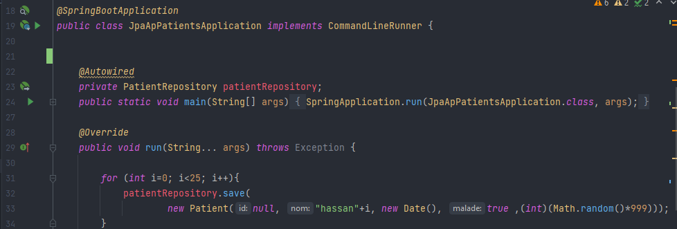

<h3>Compte rendu</h3>

<h5>Patient entity: </h5>

<h5> Configuring application.properties file: </h5>

<h5>Adding dependencies in porm.xml file (mysql, lombok ...) : </h5>

<h5>Creating PatientRepository interface that extends JPARepository: </h5>
<h6> > Adding other methods by using (findBy): </h6>

<h5>Testing different Spring Data methods: </h5>

